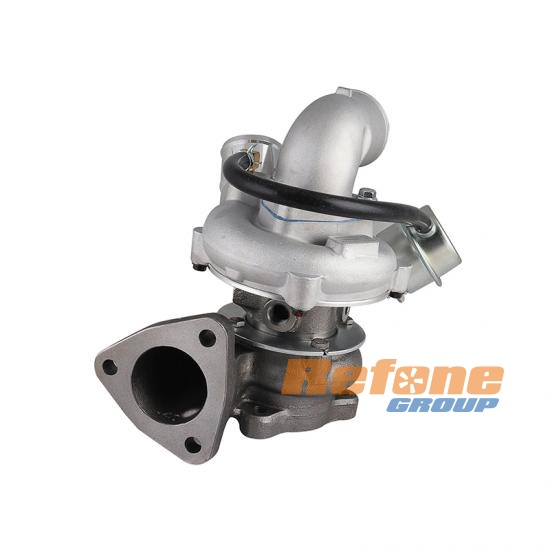
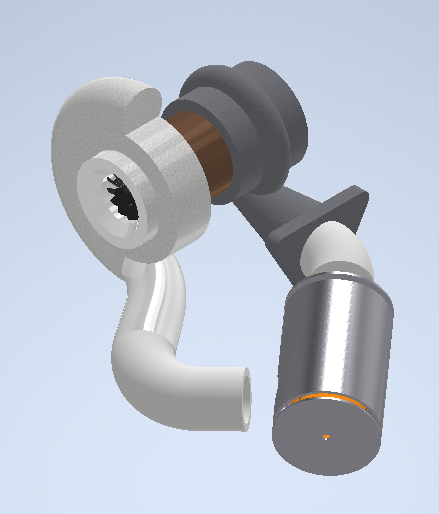
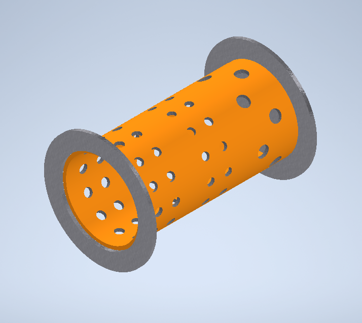

# Proyecto Turborreactor
La idea del repositorio es contar como yo hice el turborreactor, quizás hayan mejores formas o quizás la forma en que lo hice es buena, pero soy malo compartiendo experiencias y no entiendan nada, anyways, nunca he sido el mejor comunicador.
## Índice
- [Primeras ideas](#Primeras-ideas)
- [Acerca del turbo GT1749S](#Acerca-del-turbo-GT1749S)
- [Análisis Ciclo Brayton](#Análisis-Ciclo-Brayton)
- [Análisis de la reacción de combustión](#Análisis-de-la-reacción-de-combustión)
  - [Temperatura de llama adiabatica](#Temperatura-de-llama-adiabatica)
- [Diseño y simulado](#Diseño-y-simulado)
  - [Simulado](#Simulado)
## Primeras ideas
La verdad es que no hice la turbina entera yo, si es que se le puede llamar así, reutilice el turbo de un auto, el GT1749S. Muchas razones hay para esto, pero la principal es que no se como manufacturar el diseño, en efecto, puedo hacer todos los calculos y simulaciones pero de nada sirve si no puedo hacerlo, otra razón es que se abaratan los costos, ya que fue un "aporte voluntario" (gracias papá) y tambien está la razón del tiempo, ya que se tienen componentes listos y solo faltaria diseñar lo que falta (camara de combustión). Siguiendo la idea, el nombre más apropiado para el preyecto debería ser "Modificación de turbo a turborreactor".  
Bueno entonces ya sabemos que vamos a modificar un turbo y que se debe hacer la camara de combustión, por lo tanto primero es buscar las especificaciones de operación del turbo.
## Acerca del turbo GT1749S
No hay mucha información disponible, o también puede ser que no busqué lo suficiente a fondo, pero lo mejor que pude encontrar fue [esto](https://www.repuestoexpress.co/turbo-gt1749s-hyundai-starex/), que es exactamente el modelo que tengo y nos entrega informacion jugosa:
- **Presión de Operación:** Hasta 2.2 bares
- **Velocidad Máxima:** Hasta 150,000 RPM
- **Temperatura de Operación:** Soporta temperaturas de escape de hasta 850°C
- **Potencia del Motor Soportada:** Compatible con motores de hasta 140 HP
- **Compatibilidad:** Sustituto directo para motores Hyundai Starex 2.5L, sin necesidad de adaptaciones adicionales. 

Más adelante se verá para que sirven estos datos, pero por ahora solo se mencionan.

  

## Análisis Ciclo Brayton 
Lo mejor para analizar el ciclo es el clásico diagrama T-s, que se muestra a continuación,

  

- (1) Capta aire ambiente, a 293 K y 101.325 kPa, a la entrada del compresor
- (2) El aire luego es comprimido (como soporta 2.2 bares suponemos que esta es su relacion de presión) hasta 222.915 kPa, y suponiendo tambien una eficiencia del 72%, el aire alcanza una temperatura de aprox 400 K, todo esto a la salida del compresor y entrada a camara de combustión.
- (3) A la salida de la cámara de combustión y entrada de la turbina, se asume una temperatura de 1123 K (850°C) ya que es la temperatura maxima de operacion, en nuestro caso esta temperatura se alcanza por la cámara de combustión, en un auto por los gases de escape.
- (4) Después de que entra el aire a la turbina no sé que va a pasar. No hay información y en teoría podría hacer un modelo y simularla, pero en la práctica es muy dificil. Además tengo todo la informacion que el analisis del ciclo pudo aportarme para la camara de combustion, que es lo mas critico. 

Finalmente se puede determinar que la energía necesaria para subir el aire hasta 1123 K son 790 kJ/kg. 

Acerca del empuje producido tampoco es posible saberlo con certeza, quizas podria hacer algunos arreglos teoricos mas adelante, pero al menos el modelo desarrollado contempla un flujo ahogado, y para la temperatura que se alcanza en la turbina esto signifcaría una relación de presión de al menos 2.53, y con 2.2 nos quedamos cortos, aunque mas adelante se hará una discusion sobre esto
## Análisis de la reacción de combustión
Me gustaría comenzar esta sección diciendo que el combustible a utilizar será GLP (gas licuado del pétroleo), ya qué no se me ocurre otra cosa como combustible gaseoso. Para el que no lo conozca se le conoce como "gas", asi como "se acabo el gas":

  

Ahora podemos plantear la reacción balanceada para la combustión del GLP, asumiendo un GLP compuesto de 90% propano y 10% butano:  

  

Así, se obtiene una relación de 4.15 O2/F [kg/kg], queriendo decir que se necesitan 4.15 kg de oxígeno "O2" por kg de "FUEL" (butano y propano), pero como el fluido que va en el turbo es aire, que es aprox 20% oxígeno, se tiene una relación de 19.76 A/F [kg/kg].  
Antes de continuar asumiremos una última cosa, a justificar después, que es el flujo másico de aire de 0.09 kg/s, pero se obtiene al sacar cuentas del régimen de operación del Hyundai Starex, auto al cual le fue diseñado el turbo que se va a modificar.  
De lo analizado del cliclo Brayton sabemos que necesitamos 790 kJ/kg, a 0.09 kg/s de aire esto equivale a una tasa de 71.1 kW. Al utilizar como combustible GLP, principalmente propano, posee un PCI (poder calorífico inferior) de 46 350 kJ/kg, podemos estimar el flujo másico de combustible en 0.00155 kg/s, lo que nos permite calcular el flujo masico de aire estequiometrico para lograr la combustión, en este caso 0.0306 kg/s, es decir, cerca de un 1/3 del flujo de aire total (0.09 kg/s). Destacar que como el flujo de combustible es mucho menor que el del aire (2% aprox), podemos tratar la combustión como un proceso de adición de calor (flujo Rayleigh). Si el flujo de combustible fuera comparable con el del aire esto no sería posible y se escaparía de este proyecto.
### Temperatura de llama adiabatica
Para calcular la temperatura de llama adiabática, en términos simples, la temperatura que alcanza la reacción, se requiere una metedología más rigurosa, ya que la capacidad calorifica a presión constante varía con la temperatura, de hecho, se aproxima con un polinomio de tercer orden, siendo su forma general, 

  

Otro cuidado es que los reactivos no se encuentran en la temperatura estándar, por lo tanto hay que "enfriarlos". De todas maneras se hará el analisis respectivo mas adelante, por ahora solamente se presentará la ecuación de trabajo, considerando una humedad del aire del 70% y usando la composición del aire (21% oxígeno, 79% nitrógeno), 

  

Podemos entonces encontrar 4 soluciones para la temperatura de la llama, 2 reales y 2 complejas. De la reales se tienen 2 posibilidades, 2222 K (1949 °C) o 5015 K (4742 °C), sin embargo al revisar bibliografia, nos encontramos que la temperatura ronda cercana a 1980 °C, por lo tanto nos quedamos con el primer resultado, es decir, 2222 K. La mala noticia es que esto nos presenta 2 problemas,
- La llama es lo suficientemente alta para fundir el acero (1500 °C), lo que derretiría la cámara de combustión.
- Necesitamos que el aire llegue a una temperatura de 1123 K, como mencionamos anteriormente, no debe entrar a la turbina a una temperatura superior a esta.

La buena noticia es que todo tiene solución, y es que la combustión solo ocupa 1/3 del aire disponible, como se analizó anteriormente, por lo tanto el resto del aire va a cumplir 2 funciones,
- "Refrigerar" las paredes de la cámara de combustión, en respuesta al primer problema
- "Diluirse" con el resto del aire de la combustion, para bajar la temperatura hasta 1123 K, antes de entrar a la turbina.

Entonces será de vital importancia diseñar la cámara de combustión en dos cilindros concentricos, para divir el aire en un flujo primario (que participa en la reacción) y en uno secundario (que refrigera y diluye)
## Diseño y simulado
Es debatible que esta es la parte mas tediosa, ya que no hay nada escrito, solamente unas "recomendaciones iniciales de diseño", luego de eso hay que seguir un ciclo interminable de rediseño-simulado-rediseño-simulado-rediseño-simulado-etc. Asi que compartire fotos del diseño final y resultados de simulación,

  

En esta primera imagen se puede ver como queda todo armado, por la izquierda se tiene la entrada de aire, luego sale por la "caracola" y entra a la cámara de combustion. El agujero pequeño de color naranjo en la inyeccion de combustible. Luego entra de nuevo por la "caracola" a la turbina y finalmente sale por la derecha. Al centro va la lubricacion que por ahora va a ser WD-40, no recomendable ya que puede incendiarse.

  

En esta segunda imagen se ve el interior, conocido como el "liner". Los agujeros son los que permiten el flujo de aire entre el primario y el secundario. 
No se si lo he mencionado, pero la combustion se produce por el chispaso de una bujía, que deberia ser un agujero adyacente al del combustible, pero no se que bujía ocupar hasta el momento.
### Simulado
Es de mi agrado comunicar que los resultados son satisfactorios, es decir, hemos podido corregir los 2 problemas:
- La cámara de combustión no se derrite.
- El aire sale a la temperatura deseada. 

Empero la simulación nos deja una gran incognita, ya que el programa asume que la reacción ocurre, entonces si es que ocurre la reacción obtenemos esos resultados.
Por lo tanto hay total incertidumbre hasta antes de la combustión. No queda más que experimentar para ver que ocurre, y confirmar los resultados de simulación.
A continuación se muestran los tan dichosos resultados,
