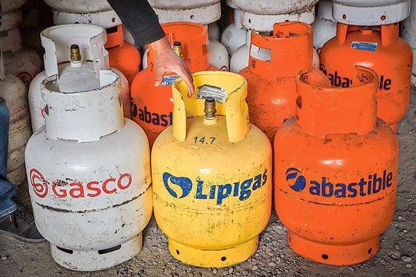

# Proyecto Turborreactor
La idea del repositorio es contar como yo hice el turborreactor, quizás hayan mejores formas o quizás la forma en que lo hice es buena, pero soy malo compartiendo experiencias y no entiendan nada, anyways, nunca he sido el mejor comunicador.
## Índice
- [Primeras ideas](#Primeras-ideas)
- [Acerca del turbo GT1749S](#Acerca-del-turbo-GT1749S)
- [Análisis Ciclo Brayton](#Análisis-Ciclo-Brayton)
- [Diseño cámara combustión](#Diseño-cámara-combustión)
## Primeras ideas
La verdad es que no hice la turbina entera yo, si es que se le puede llamar así, reutilice el turbo de un auto, el GT1749S. Muchas razones hay para esto, pero la principal es que no se como manufacturar el diseño, en efecto, puedo hacer todos los calculos y simulaciones pero de nada sirve si no puedo hacerlo, otra razón es que se abaratan los costos, ya que fue un "aporte voluntario" (gracias papá) y tambien está la razón del tiempo, ya que se tienen componentes listos y solo faltaria diseñar lo que falta (camara de combustión). Siguiendo la idea, el nombre más apropiado para el preyecto debería ser "Modificación de turbo a turborreactor". 

Bueno entonces ya sabemos que vamos a modificar un turbo y que se debe hacer la camara de combustión, por lo tanto primero es buscar las especificaciones de operación del turbo, hacer un par de supuestos, saber sus restricciones de operación, etc. Luego se analiza el ciclo Brayton y se podrá comenzar a diseñar la camara de combustión, ocupando para esto Inventor y ANSYS Fluent
## Acerca del turbo GT1749S
No hay mucha información disponible, o también puede ser que no busqué lo suficiente a fondo, pero lo mejor que pude encontrar fue [esto](https://www.repuestoexpress.co/turbo-gt1749s-hyundai-starex/), que es exactamente el modelo que tengo y nos entrega informacion jugosa:
- **Presión de Operación:** Hasta 2.2 bares
- **Velocidad Máxima:** Hasta 150,000 RPM
- **Temperatura de Operación:** Soporta temperaturas de escape de hasta 850°C
- **Potencia del Motor Soportada:** Compatible con motores de hasta 140 HP
- **Compatibilidad:** Sustituto directo para motores Hyundai Starex 2.5L, sin necesidad de adaptaciones adicionales. 

Más adelante se verá para que sirven estos datos, pero por ahora solo se mencionan. AÑADIR FOTO EPICA DELE TURBO
## Análisis Ciclo Brayton 
Lo mejor para analizar el ciclo es el clásico diagrama T-s, que se muestra a continuación,

  

- (1) Capta aire ambiente, a 293 K y 101.325 kPa, a la entrada del compresor
- (2) El aire luego es comprimido (como soporta 2.2 bares suponemos que esta es su relacion de presión) hasta 222.915 kPa, y suponiendo tambien una eficiencia del 72%, el aire alcanza una temperatura de aprox 400 K, todo esto a la salida del compresor y entrada a camara de combustión.
- (3) A la salida de la cámara de combustión y entrada de la turbina, se asume una temperatura de 1123 K (850°C) ya que es la temperatura maxima de operacion, en nuestro caso esta temperatura se alcanza por la cámara de combustión, en un auto por los gases de escape.
- (4) Después de que entra el aire a la turbina no sé que va a pasar. No hay información y en teoría podría hacer un modelo y simularla, pero en la práctica es muy dificil. Además tengo todo la informacion que el analisis del ciclo pudo aportarme para la camara de combustion, que es lo mas critico. 

Finalmente se puede determinar que la energía necesaria para subir el aire hasta 1123 K son 790 kJ/kg. 

Acerca del empuje producido tampoco es posible saberlo con certeza, quizas podria hacer algunos arreglos teoricos mas adelante, pero al menos el modelo desarrollado contempla un flujo ahogado, y para la temperatura que se alcanza en la turbina esto signifcaría una relación de presión de al menos 2.53, y con 2.2 nos quedamos cortos, aunque mas adelante se hará una discusion sobre esto
## Diseño cámara combustión
Me gustaría comenzar diciendo que el combustible a utilizar sera GLP (gas licuado del pétroleo), ya qué no se me ocurre otra cosa como combustible gaseoso. Para el que no lo conozca se le conoce como "gas", asi como "se acabo el gas":

  

Ahora podemos plantear la reacción balanceada para la combustión del GLP, asumiendo un GLP compuesto de 90% propano y 10% butano: 

  

